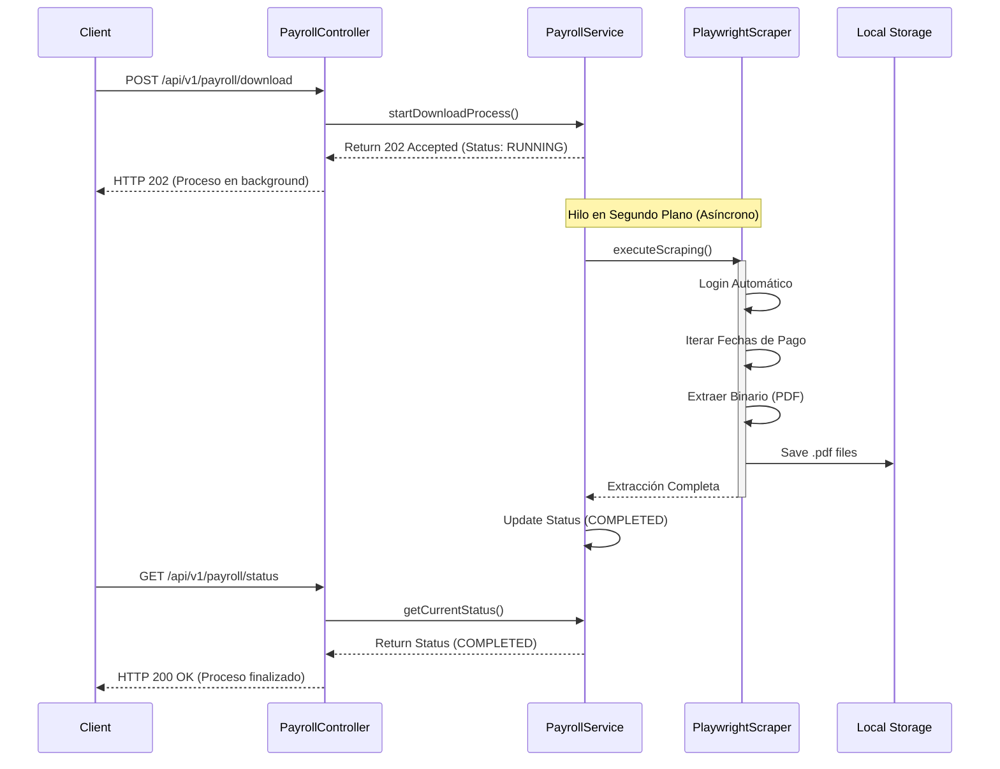

# HumanSite Payroll API Service

Microservicio desarrollado en **Spring Boot** con **Kotlin** diseñado para la automatización, orquestación y extracción masiva de recibos de nómina desde el portal de HumanSite mediante RPA (Robotic Process Automation) utilizando **Playwright**.

##  Arquitectura del Sistema (N-Tier MVC)

El proyecto está estructurado utilizando un patrón arquitectónico clásico de capas (MVC / N-Tier) que separa las responsabilidades de forma clara y concisa:

- `controller`: Expone la interfaz de comunicación mediante una API REST documentada con OpenAPI (Swagger).
- `service`: Contiene la lógica de negocio, la orquestación asíncrona de los hilos de ejecución y la integración con Playwright.
- `repository`: Define los contratos (interfaces) para la abstracción de operaciones de extracción y persistencia, garantizando un bajo acoplamiento.
- `model`: Modelos de dominio y estructuras de datos puras sin lógica acoplada (POJOs/Data Classes).
- `config`: Configuración transversal de propiedades del sistema (YAML Binding) y documentación.

### 🔄 Flujo de Ejecución (Workflow)

El siguiente diagrama ilustra el comportamiento asíncrono y la interacción de los componentes durante una solicitud de extracción:



## 🛠️ Requisitos Previos

- **Java 17** o superior
- **Apache Maven**
- No se requiere la instalación manual de navegadores; **Playwright** gestionará las dependencias de Chromium en la primera ejecución.

## ⚙️ Configuración del Entorno (`application.yml`)

Las variables y secretos de entorno deben ser inyectados o modificados en el archivo `src/main/resources/application.yml`:

```yaml
server:
  port: 5000

humansite:
  credentials:
    username: "USER_ID"
    password: "PASSWORD"
  base-url: "https://ahr.humansite.com.mx"
  download-dir: "pdf"
```

## 🚀 Endpoints y Uso de la API (RESTful)

El microservicio incluye documentación interactiva y auto-generada mediante **Swagger UI**. Una vez en ejecución, se puede acceder a la consola interactiva a través de:

👉 **[http://localhost:5000/swagger-ui.html](http://localhost:5000/swagger-ui.html)**

| Método | Endpoint | Descripción |
|--------|----------|-------------|
| `POST` | `/api/v1/payroll/download` | Inicia el motor de scraping de manera asíncrona (No bloqueante). |
| `GET` | `/api/v1/payroll/status` | Monitorea el ciclo de vida del proceso (`IDLE`, `RUNNING`, `COMPLETED`, `FAILED`). |
| `GET` | `/api/v1/payroll/files` | Obtiene el inventario de todos los recibos de nómina extraídos exitosamente. |

## 💻 Instrucciones de Ejecución

Para inicializar el servidor local de desarrollo:

```bash
.\mvnw.cmd clean spring-boot:run
```
